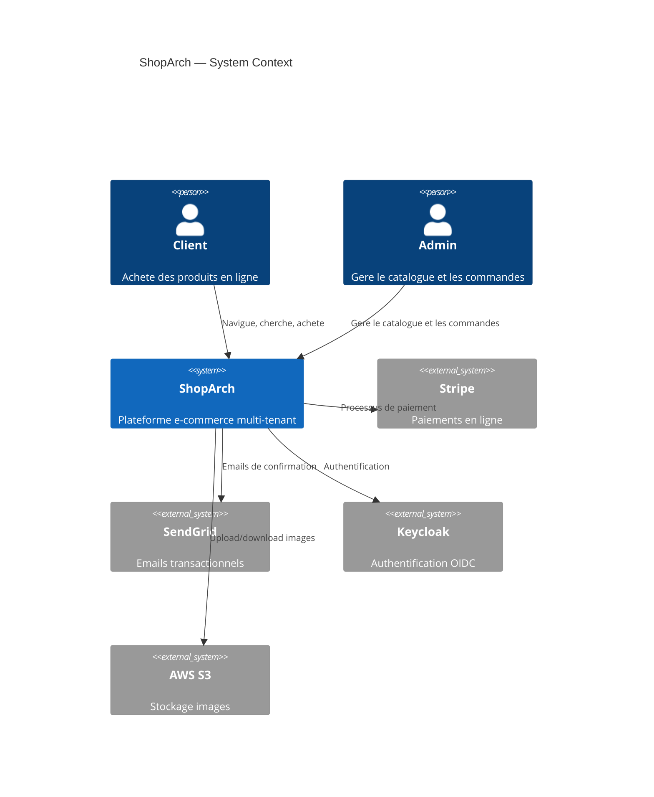
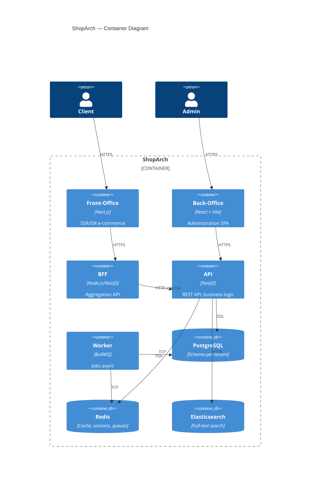
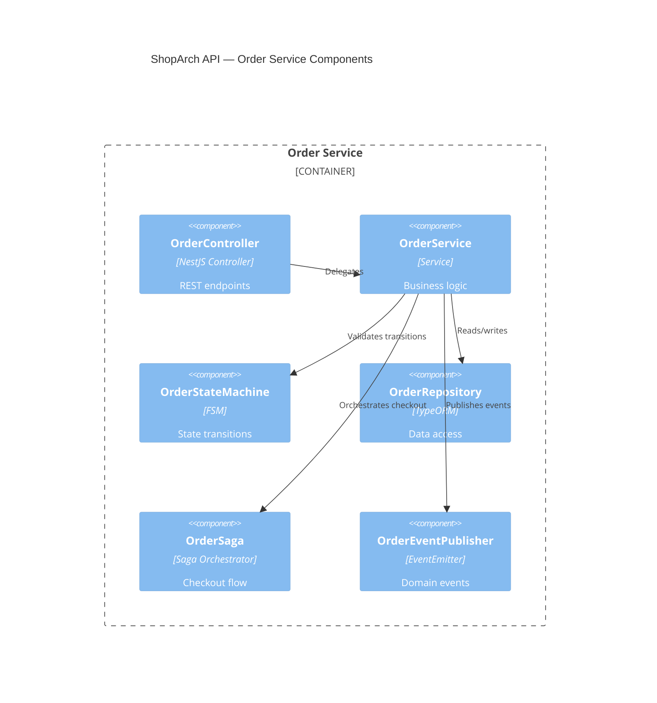

# Correction — Exercice 53 : ADR et diagrammes C4

## ADR-001 : PostgreSQL vs MongoDB

```markdown
# ADR-001: Base de donnees principale

## Date
2026-01-15

## Statut
Accepted

## Contexte
ShopArch a besoin d'une base de donnees pour stocker les produits, commandes,
utilisateurs et tenants. Le modele de donnees est relationnel (commandes liees
aux produits, produits lies aux categories) avec des besoins de transactions ACID
pour le checkout.

## Alternatives considerees
1. **PostgreSQL** — RDBMS, ACID, JSONB, full-text search, schema-per-tenant
2. **MongoDB** — Document store, flexible schema, horizontal scaling natif
3. **CockroachDB** — SQL distribue, multi-region natif

## Decision
PostgreSQL.

## Justification
- Le modele est fortement relationnel (FK, JOINs, transactions multi-tables)
- JSONB permet la flexibilite quand necessaire (i18n, metadata)
- Full-text search natif (tsvector) evite un service supplementaire pour les petits volumes
- Schema-per-tenant possible pour le multi-tenant
- Ecosysteme mature (TypeORM, pgbouncer, pg_stat_statements)
- CockroachDB ajoute de la complexite pour un scaling pas encore necessaire

## Consequences
### Positives
- Transactions ACID pour le checkout (pas de sur-vente)
- JSONB pour les champs flexibles sans migration
- Full-text search sans service supplementaire

### Negatives
- Scaling horizontal plus complexe que MongoDB (read replicas + sharding manuel)
- Schema-per-tenant = N schemas a migrer (vs RLS = 1 schema)
- Si le volume depasse 100M lignes, migration vers un sharding sera couteuse

### Risques
- Si le trafic atteint 10x, les read replicas pourraient ne pas suffire
- Mitigation : monitoring + capacity planning regulier
```

## ADR-002 : Multi-tenant isolation

```markdown
# ADR-002: Strategie d'isolation multi-tenant

## Date
2026-01-20

## Statut
Accepted

## Contexte
ShopArch est un SaaS multi-tenant. Chaque tenant doit avoir ses donnees
completement isolees. Un tenant ne doit JAMAIS voir les donnees d'un autre.

## Alternatives considerees
1. **Schema-per-tenant** — un schema PostgreSQL par tenant, SET search_path
2. **Row-Level Security** — une seule table, filtre par tenant_id via RLS
3. **Database-per-tenant** — une base complete par tenant

## Decision
Schema-per-tenant.

## Justification
- Isolation forte (pas de risque de fuite cross-tenant par oubli de WHERE)
- Performance previsible (indexes par tenant, pas de scan sur une table geante)
- Backup/restore par tenant possible
- Moins complexe que database-per-tenant (1 seul serveur PostgreSQL)
- RLS est elegant mais un seul oubli de politique = fuite de donnees

## Consequences
### Positives
- Isolation physique (schema = namespace PostgreSQL)
- Backup par tenant facile (pg_dump -n tenant_xxx)
- Performance : indexes dedies, pas de scan cross-tenant

### Negatives
- Migrations : il faut migrer N schemas (script de migration en boucle)
- Connexion : SET search_path a chaque requete (middleware obligatoire)
- Limite PostgreSQL : ~10 000 schemas confortables, au-dela il faut sharding
- Plus complexe que RLS pour les requetes cross-tenant (reporting admin)
```

## ADR-003 : BFF vs API Gateway

```markdown
# ADR-003: Aggregation front-end

## Date
2026-02-01

## Statut
Accepted

## Contexte
Le front-end mobile fait 6 appels API pour afficher la page d'accueil.
Sur un reseau 3G, les 6 round-trips prennent 3 secondes.

## Alternatives considerees
1. **BFF (Backend-For-Frontend)** — service Node.js qui agrege les appels
2. **API Gateway** — Kong/Nginx avec plugins d'aggregation
3. **GraphQL** — un seul endpoint, le client demande ce qu'il veut

## Decision
BFF.

## Justification
- Le BFF permet une logique d'aggregation custom par ecran (home, product, checkout)
- L'API Gateway a des capacites d'aggregation limitees (plugins complexes)
- GraphQL est puissant mais ajoute de la complexite (schema, resolvers, N+1)
- Le BFF est ecrit en TypeScript (meme stack que le front-end)
- Le BFF peut adapter la reponse par device (mobile vs desktop)

## Consequences
### Positives
- 1 seul appel API par ecran (au lieu de 6)
- Adaptation par device (mobile: moins de donnees)
- Cache au niveau du BFF (categories, promos)
- Meme stack TypeScript que le front

### Negatives
- Service supplementaire a maintenir et deployer
- Single point of failure (si le BFF est down, tout le front est down)
- Risque de logique metier qui glisse dans le BFF
- Mitigation : le BFF ne fait QUE de l'aggregation + transformation
```

## C4 Level 1 — Context (Mermaid)



## C4 Level 2 — Container



## C4 Level 3 — Component (Order Service)



## Ce que tu aurais pu oublier

### 1. ADR sans alternatives
```
FAUX — "On a choisi PostgreSQL" (sans expliquer pourquoi pas MongoDB)
CORRECT — lister les alternatives avec leurs avantages/inconvenients
         La decision est un TRADE-OFF, pas un choix evident
```

### 2. ADR sans consequences negatives
```
FAUX — "PostgreSQL est parfait pour notre cas" (tout est positif)
CORRECT — chaque decision a des inconvenients et des risques
         Les consequences negatives montrent qu'on a pense au trade-off
```

### 3. Diagrammes dans un outil ferme
```
FAUX — diagrammes Lucidchart/Draw.io (non versiones, desynchronises)
CORRECT — diagrammes as code (Mermaid, Structurizr DSL) versiones dans git
         Le diagramme evolue avec le code
```

### 4. C4 trop detaille ou trop vague
```
FAUX — Level 1 qui montre les tables de la DB (trop detaille)
CORRECT — chaque niveau a un public et un niveau de detail specifique
         Level 1 = management, Level 2 = tech leads, Level 3 = developpeurs
```
